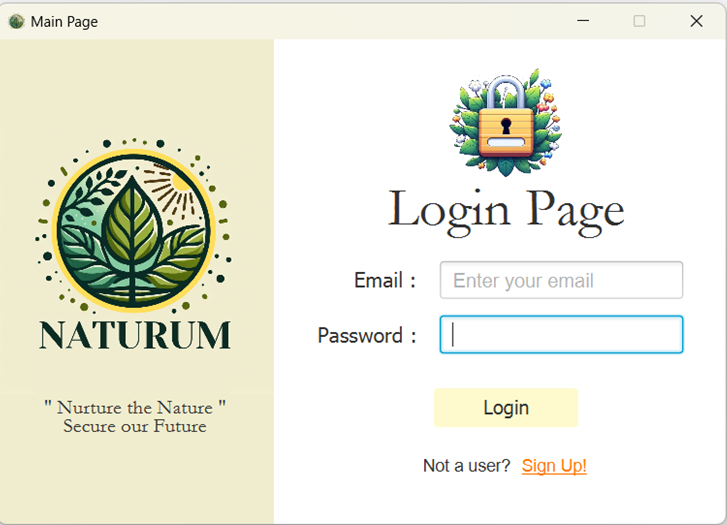
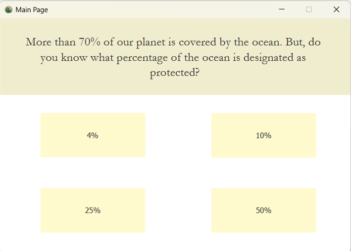
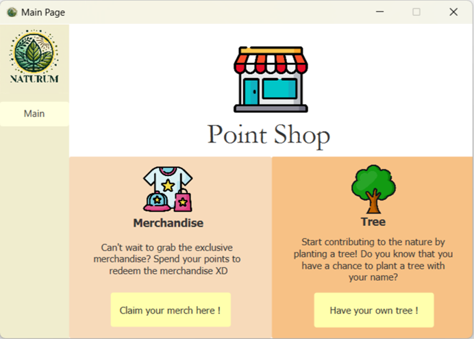
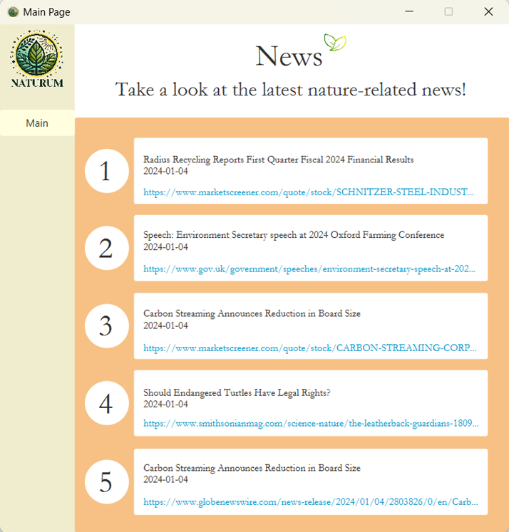

#  Naturum

**Naturum** is a nature conservation awareness application that educates users about environmental issues through interactive trivia, a built-in reward system, and a live news feed — all wrapped in a polished JavaFX GUI.

> Built as a university group project for **WIX1002 Fundamentals of Programming** at Universiti Malaya.

---

## 📌 Problem Statement

Public awareness of environmental issues remains low. Naturum aims to bridge that gap by gamifying nature education — rewarding users for learning about the world around them.

---

## ✨ Features

### Core Features

| Feature | Description |
|---|---|
| **User Accounts** | Personalized accounts tracking email, username, registration date, and points earned. |
| **Login / Registration** | Secure sign-up with email validation and unique username enforcement. Existing users can log in with their credentials. |
| **Daily Trivia** | Daily quiz questions with four choices. Users get two attempts — 2 points for a first-try correct, 1 point for a second-try correct. Previous questions can be reviewed or reattempted. |
| **Daily Check-In** | Users earn 1 point per day by checking in (limited to once per day). |
| **Point Shop** | Redeem points for nature-caring merchandise (canvas bags, keychains, soft toys) or plant a tree with your name on it. |
| **Donations** | Donate to NGOs (WWF, Fauna & Flora International, Malaysia Nature Society) and earn points at a rate of $1 = 10 points. |
| **News Section** | Stay informed with the latest nature-related headlines, displayed with publication dates and clickable URLs. |

### Extra Features

| Feature | Description |
|---|---|
| **JavaFX GUI** | A full graphical user interface built with JavaFX and FXML. |
| **MySQL Database** | Persistent data storage using a relational database. |
| **Password Hashing** | User passwords are hashed before storage for security. |
| **Global Leaderboard** | XP-based ranking system (XP accumulates alongside points but is unaffected by redemptions). Ties are broken on a first-come-first-serve basis. |
| **Live News API** | Fetches real-time nature headlines from a news API. |

---

## 🛠️ Tech Stack

- **Language:** Java
- **GUI Framework:** JavaFX + FXML
- **Database:** MySQL
- **Build Tool:** Apache Ant (NetBeans)
- **IDE:** Apache NetBeans

---

## 📁 Project Structure

```
naturum/
├── src/
│   ├── Login/              # Authentication, user model, password hashing
│   ├── trivia/             # Trivia engine, questions, and controllers
│   ├── Daily_Check_In/     # Daily check-in logic
│   ├── Donation_/          # Donation handling and recording
│   ├── PointShop/          # Merchandise and tree planting redemption
│   ├── XP_Leaderboard/     # Global leaderboard
│   ├── news/               # News API integration and display
│   ├── FXMLfiles/          # All FXML layout files
│   └── assets/             # Images, icons, and logos
├── build.xml               # Ant build configuration
├── manifest.mf             # JAR manifest
└── nbproject/              # NetBeans project metadata
```

---

## 🚀 Getting Started

### Prerequisites

- **Java JDK 8+** (with JavaFX bundled, or add JavaFX separately for JDK 11+)
- **MySQL** server running locally
- **Apache NetBeans** (recommended) or any Java IDE with Ant support

### Setup

1. **Clone the repository**
   ```bash
   git clone https://github.com/<your-username>/naturum.git
   cd naturum
   ```

2. **Set up the MySQL database**
   - Create a database and configure the connection details in the source code (see `LoginSQLController.java` and `SQLController.java`).

3. **Open in NetBeans**
   - Open the project folder in NetBeans.
   - Ensure all dependencies (JavaFX, MySQL Connector/J) are on the classpath.

4. **Run the application**
   - Build and run from NetBeans, or via Ant:
     ```bash
     ant run
     ```

---

## 📸 Screenshots

| | |
|:---:|:---:|
|  |  |
|  |  |

---

## 👥 Contributors

- [@Wrynaft](https://github.com/Wrynaft)
- [@johnong04](https://github.com/johnong04)
- [@khoonlyn913](https://github.com/khoonlyn913)
- [@Choongmh](https://github.com/Choongmh)
- [@JuenKai530](https://github.com/JuenKai530)

---

## 📄 License

This project was developed for academic purposes as part of the WIX1002 course at Universiti Malaya.
